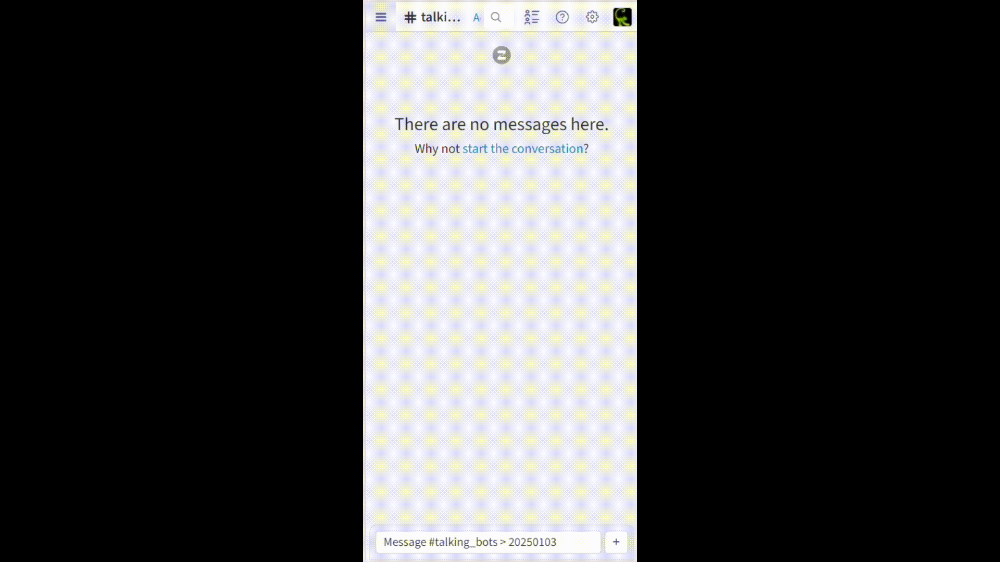

# go-zulip

### Golang Client Library for Zulip (9.4)

`go-zulip` is a Golang client library designed to interact with Zulip's REST API. It allows you to send messages, receive real-time events, and perform various other operations with ease.

## Installation

```sh
go get github.com/wakumaku/go-zulip@latest
```

### Usage

Initialize the client with your Zulip server URL, email, and API key.

```golang
c, err := zulip.NewClient("https://chat.zulip.org", "email@zulip.org", "0123456789")
if err != nil {
	log.Fatal(err)
}
```

Or from a `.zuliprc` file
```golang
c, err := zulip.NewClientFromZuliprc("path/to/.zuliprc")
if err != nil {
	log.Fatal(err)
}
```

Sending a message:

```golang
// Create a new message service
msgSvc := messages.NewService(c)

// Send a message to a channel/topic
resp, err := msgSvc.SendMessageToChannelTopic(ctx, 
	recipient.ToChannel("general"), "greetings", 
	"Hello Zulip!",
)

...

// Send a private message to a user
resp, err := msgSvc.SendMessageToUsers(ctx, 
	recipient.ToUser("john.doe"), 
	"Hello John!",
)

...

// Send a private message to multiple users
usernames := []string{"john.doe", "jane.doe"}
resp, err := msgSvc.SendMessageToUsers(ctx, 
	recipient.ToUsers(usernames), 
	"Hello John and Jane!",
)

```

Receiving realtime events:

```golang
// Create a new realtime service
realtimeSvc := realtime.NewService(c)

// Register a queue passing the events we want to receive
queue, err := realtimeSvc.RegisterEvetQueue(ctx,
	realtime.EventTypes(
		events.AlertWordsType,
		events.AttachmentType,
		events.MessageType,
		events.PresenceType,
		events.RealmEmojiType,
		events.RealmUserType,
		events.SubmessageType,
		events.TypingType,
		events.UpdateMessageType,
	),
	realtime.AllPublicStreams(true),
)
if err != nil {
	log.Fatalf("error registering event queue: %s", err)
}

if queue.IsError() {
	log.Fatalf("%s: %s", queue.Msg(), queue.Code())
}

log.Printf("QueueId: %s", queue.QueueId)

lastEventID := queue.LastEventId

// Infinite loop polling for new events
for {
	// Long polling HTTP Request
	eventsFromQueue, err := realtimeSvc.GetEventsEventQueue(ctx, queue.QueueId, realtime.LastEventID(lastEventID))
	if err != nil {
		log.Fatalf("error getting events from queue: %s", err)
	}

	for _, e := range eventsFromQueue.Events {
		log.Printf("#%d %s", e.EventID(), e.EventType())
		lastEventID = e.EventID()
	}
}
```

### Other Examples

Check [/examples](examples) folder.

* **Talking Robots**: two bots talking demonstrating sending messages, reactions and events



### Supported API Endpoints

* [**Messages**](messages)
	* [x] Send a message
	* [x] Upload a file
	* [x] Edit a message
	* [x] Delete a message
	* [x] Get messages
	* [x] Add an emoji reaction
	* [x] Remove an emoji reaction
	* [x] Render a message
	* [x] Fetch a single message
	* Check if messages match a narrow
	* Get a message's edit history
	* Update personal message flags
	* Update personal message flags for narrow
	* Mark all messages as read
	* Mark messages in a channel as read
	* Mark messages in a topic as read
	* Get a message's read receipts
* **Scheduled messages**
	* Get scheduled messages
	* Create a scheduled message
	* Edit a scheduled message
	* Delete a scheduled message
* **Drafts**
	* Get drafts
	* Create drafts
	* Edit a draft
	* Delete a draft
	* Get all saved snippets
	* Create a saved snippet
	* Delete a saved snippet
* [**Channels**](channels)
	* [x] Get subscribed channels
	* [x] Subscribe to a channel
	* Unsubscribe from a channel
	* Get subscription status
	* Get channel subscribers
	* Update subscription settings
	* Get all channels
	* Get a channel by ID
	* Get channel ID
	* Create a channel
	* Update a channel
	* Archive a channel
	* Get channel's email address
	* Get topics in a channel
	* Topic muting
	* Update personal preferences for a topic
	* Delete a topic
	* Add a default channel
	* Remove a default channel
* [**Users**](users)
	* [x] Get a user
	* [x] Get a user by email
	* [x] Get own user
	* [x] Get all users
	* [x] Create a user
	* [x] Update a user
	* Update a user by email
	* Deactivate a user
	* Deactivate own user
	* Reactivate a user
	* [x] Get a user's status
	* [x] Update your status
	* Set "typing" status
	* Get a user's presence
	* Get presence of all users
	* Update your presence
	* Get attachments
	* Delete an attachment
	* Update settings
	* Get user groups
	* Create a user group
	* Update a user group
	* Deactivate a user group
	* Update user group members
	* Update subgroups of a user group
	* Get user group membership status
	* Get user group members
	* Get subgroups of a user group
	* Mute a user
	* Unmute a user
	* Get all alert words
	* Add alert words
	* Remove alert words
* [**Invitations**](invitations)
	* Get all invitations
	* Send invitations
	* [x] Create a reusable invitation link
	* Resend an email invitation
	* Revoke an email invitation
	* Revoke a reusable invitation link
* [**Server & organizations**](org)
	* Get server settings
	* Get linkifiers
	* Add a linkifier
	* Update a linkifier
	* Remove a linkifier
	* Reorder linkifiers
	* Add a code playground
	* Remove a code playground
	* Get all custom emoji
	* [x] Upload custom emoji
	* Deactivate custom emoji
	* Get all custom profile fields
	* Reorder custom profile fields
	* Create a custom profile field
	* Update realm-level defaults of user settings
	* Get all data exports
	* Create a data export
	* Get data export consent state
* [**Real-time events**](realtime)
	* [x] Register an event queue
	* [x] Get events from an event queue
	* [x] Delete an event queue
* [**Specialty endpoints**](specialty)
	* [x] Fetch an API key (production)
	* [x] Fetch an API key (development only)
	* Send a test notification to mobile device(s)
	* Add an APNs device token
	* Remove an APNs device token
	* Add an FCM registration token
	* Remove an FCM registration token
	* Create BigBlueButton video call

### Developing

Check [/dev](dev) folder and read the SETUP.md file.

### Documentation

For detailed documentation on all available methods and features, please refer to the [GoDoc](https://pkg.go.dev/github.com/wakumaku/go-zulip).

### Contributing

Contributions are welcome! Please open an issue or submit a pull request on GitHub.
